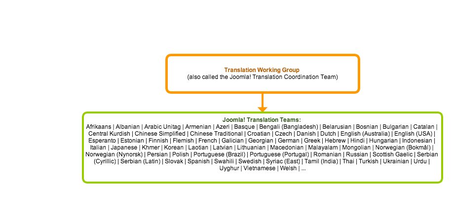
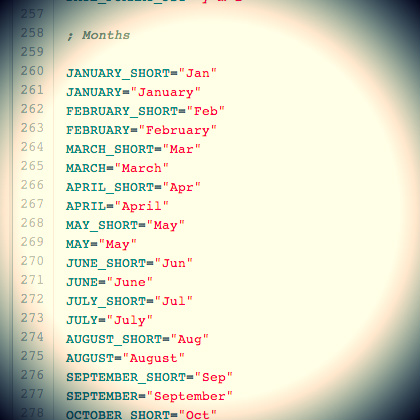
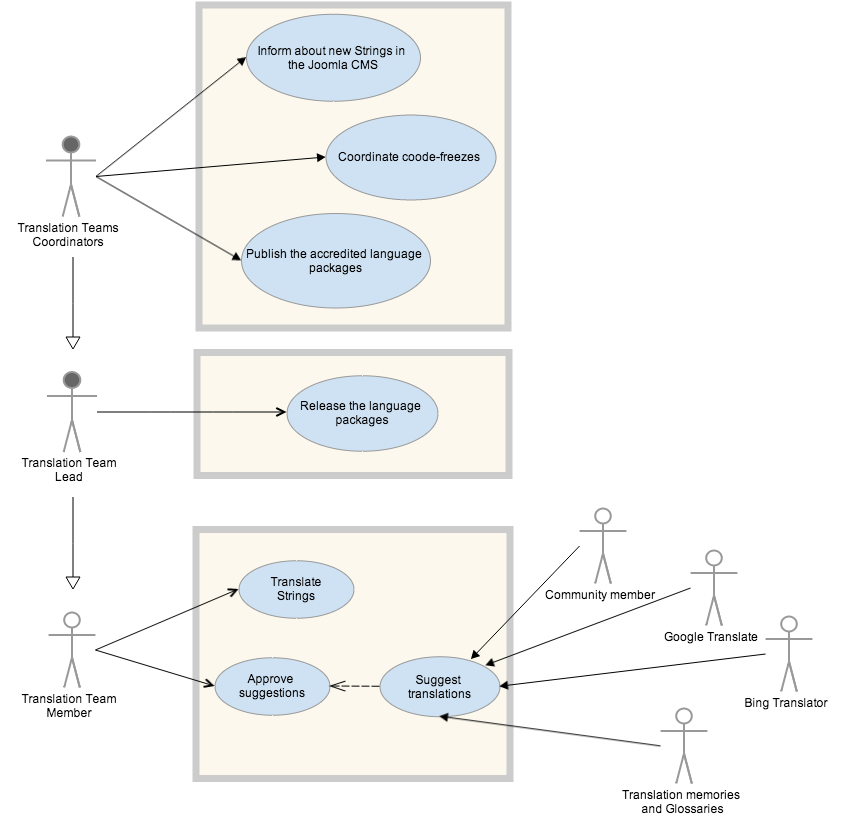

translate.joomla.org project
===========

## THIS DOCUMENT IS A DRAFT

>**Important note**: this document do not pretend to be a document for software engineers but for the broad community, and specially to be produced by the broad community, that is the reason because maybe we are not enough accurate with, for example, the UML notation.

translate.joomla.org is the starting point of a new working team that wants to give answer to a specific goal stablished by the Joomla Production Leadership Team in 2013 (see http://developer.joomla.org/news/74-production-goals-for-2013.html):

> **Goal #5**: Improve processes in Translating the Joomla Software and support the enhancement of the Joomla CMS multilingual system.

Specifically to one of its targets:

> **5.2: Halve the dedicated time needed by a Translation Team member to provide a language package for Joomla.**
> In agreement with the Translation Team, dedicate resources on improving processes and tools to automate the creation of translation packages and uploading them to the Joomla Languages Server.

Find more information about the Translations Working group at http://docs.joomla.org/Translations_Working_Group

## The project
This project intends to document the current needs of the Joomla Translations Working Group needs that we want to solve in 2014. We request community participation by commenting, advising, consulting and helping to develop the final solution that could bring the Joomla Internationalization to the next level. 

### The Team
The Joomla Content Management System translation is carried by people all arround the world that volunteer their time organised in teams, the **Translation Working group** (also called the Joomla! Translation Coordination Team) and the **Translation Teams**.

The purpose of the **Translation Working Group** is to be a liaison between the Joomla! Translation Teams, the International Community and the other Joomla! Teams on user and technical matters relating to the translation of the Joomla! application.

In brief the main task of the Translation Teams consist in translate and adapt to the Joomla default language en-GB (english - Great Britain) to other languages:

* in the installer: [https://github.com/joomla/joomla-cms/tree/staging/installation/language](https://github.com/joomla/joomla-cms/tree/staging/installation/language)
* the administrator: [https://github.com/joomla/joomla-cms/tree/staging/administrator/language/en-GB](https://github.com/joomla/joomla-cms/tree/staging/administrator/language/en-GB)
* and the frontend: [https://github.com/joomla/joomla-cms/tree/staging/language/en-GB](https://github.com/joomla/joomla-cms/tree/staging/language/en-GB)

Find all information about the Team at: [http://docs.joomla.org/Translations_Working_Group](http://docs.joomla.org/Translations_Working_Group)

Current members of Translations Teams can be found here: [http://forum.joomla.org/memberlist.php?mode=group&g=13](http://forum.joomla.org/memberlist.php?mode=group&g=13)

Current Joomla Translations can be found here:
[http://community.joomla.org/translations.html
](http://community.joomla.org/translations.html)

### The Actors
The Translations Working Group has the following roles:

#### The Translation Team Coordinators

* Inform to the Translation Teams about the existence of new strings in the Joomla CMS that needs translation for the next release
* Coordinate code-freezes in agreement with the Joomla Production Leadership Team and the Developing Community to give enough time to translators to finish the translations before the next official release. See an example at: [https://groups.google.com/forum/#!topic/joomlabugsquad/dTP4HgY-ZFE](https://groups.google.com/forum/#!topic/joomlabugsquad/dTP4HgY-ZFE)
* Provide an infrastructure and publish the language packages ensuring their availability for the the users: 

  * [http://community.joomla.org/translations.html](http://community.joomla.org/translations.html)
  * Accreditted Joomla! Translations server (used by the [automatic language installer](http://magazine.joomla.org/issues/issue-oct-2012/item/895-google-summer-of-code-the-future-of-the-languages-installer-tool)): [http://update.joomla.org/language/translationlist.xml](http://update.joomla.org/language/translationlist.xml) (for Joomla 2.5) and [http://update.joomla.org/language/translationlist_3.xml](http://update.joomla.org/language/translationlist_3.xml) (for Joomla 3)

#### Translation Team Lead
Is responsible of an especific language and is responsible for:

* Coordinate and facilitate a team of translators that works on a specific language 
* Release a package once is ready for use

#### The Translators
Translators are Key elements in the process, they ensure the quality of the translations (don't dream, machine translation can not replace translators )

* Define a Glossary
* Translate the strings
* Accept suggested trasnlations from the community or automated translating services

#### Community members
Most internet project get imputs from their community to enhance their internationalization: 

* Facebook (see: [http://www.insidefacebook.com/2008/04/02/now-you-can-help-translate-facebook-into-any-language/](http://www.insidefacebook.com/2008/04/02/now-you-can-help-translate-facebook-into-any-language/), 
* Twitter (see: [https://support.twitter.com/articles/434816-about-the-twitter-translation-center](https://support.twitter.com/articles/434816-about-the-twitter-translation-center) 
* or RememberTheMilk (see [http://www.rememberthemilk.com/services/translate/](http://www.rememberthemilk.com/services/translate/)

The Joomla community is an powerful source of suggestions of translations.

#### The challenges
Below you can find some of the already identified needs that the tool should/could solve:
- the tool should help to automate the releases of language packages and sends them to the download page, language update servers...
- the tool should help to warn translators (maybe e-mail them) when new strings when the main en-GB files get changed in the blessed repository
- the tool could be flexible enough that allows translators to work with their preferred translation tool: com_localise, transifex, crowdin...
- the tool could be Git based, but on it's base,  not in it's interface (because translators are not necessarily developers)
- and maybe, the tool could become something that can be used too by 3rd party extension developers to want to get support from the Joomla community translating their open source solutions. Something like JED, maybe?
